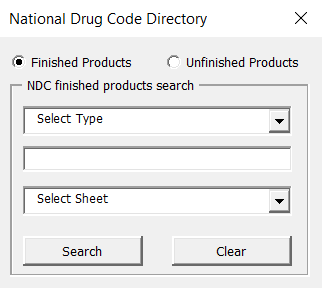
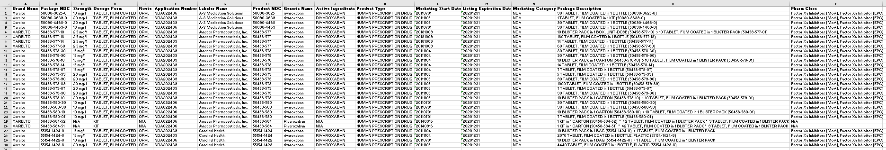

# openFDA API for Excel VBA
## Purpose and Features
- Demonstrate [openFDA API](https://open.fda.gov/) usage within the VBA framework
- Create a replica of the FDA's [NDC Directory](https://www.accessdata.fda.gov/scripts/cder/ndc/index.cfm)
## Compatibility
- Microsoft Excel 2010+ (OS must be able to support Regular Expression, Dictionary, and XMLHTTP objects)
- Note: I have also translated this repository to Javascript for [Google Sheets](https://github.com/EszopiCoder/google-openfda-api)
## How It Works
1. The openFDA API is called with the XMLHTTP object
2. The XMLHTTP object returns a JSON script
3. The JSON script is parsed using code found [here](https://github.com/omegastripes/VBA-JSON-parser)
4. The parsed JSON script is reformatted to write to an Excel worksheet
## Usage
Download 'NDC Directory.xlsm'

The current file has two main subs:
- `Sub openSearchForm()` Opens the userform for the NDC directory
- `Sub resetSheet()` Resets the formatting and clears the active sheet

Note: The search field(s) do not support partial spelling
## Sample Images

